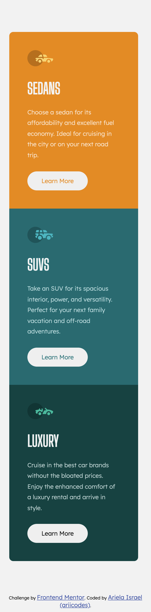

# Frontend Mentor - 3-column preview card component solution

This is a solution to the [3-column preview card component challenge on Frontend Mentor](https://www.frontendmentor.io/challenges/3column-preview-card-component-pH92eAR2-). Frontend Mentor challenges help you improve your coding skills by building realistic projects. 

## Table of contents

- [Overview](#overview)
  - [The challenge](#the-challenge)
  - [Screenshot](#screenshot)
- [My process](#my-process)
  - [Built with](#built-with)
  - [What I learned](#what-i-learned)
  - [Continued development](#continued-development)
- [Author](#author)

## Overview

### The challenge

Users should be able to:

- View the optimal layout depending on their device's screen size
- See hover states for interactive elements

### Screenshot

## My process

### Built with

- Semantic HTML5 markup
- CSS custom properties
- Flexbox
- Mobile-first workflow

### What I learned

I've learned to fully complete the HTML first before moving onto CSS. I've also learned that it's okay to use pixels when keeping porportions.

### Continued development

I plan to recreate this project using React once I tackle it.

## Author

- Frontend Mentor - [@ariicodes](https://www.frontendmentor.io/profile/ariicodes)
- Twitter - [@ariicodes](https://www.twitter.com/ariicodes)# 3-column-frontend-mentor-project
# 3-column-frontend-mentor-project
